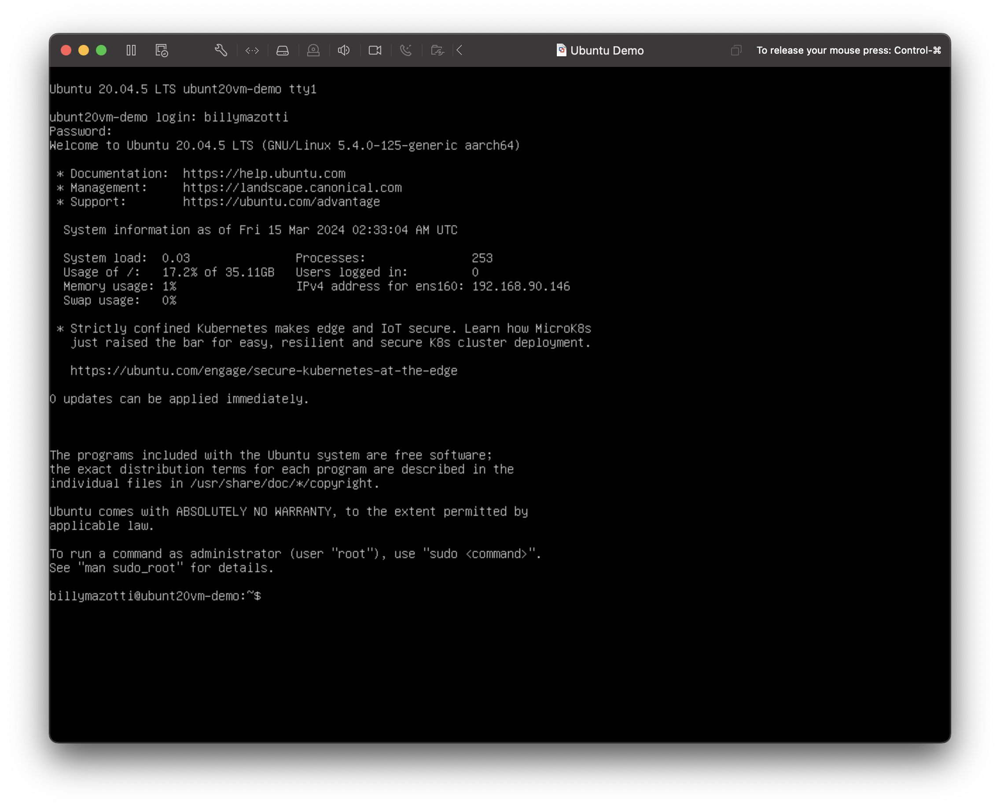
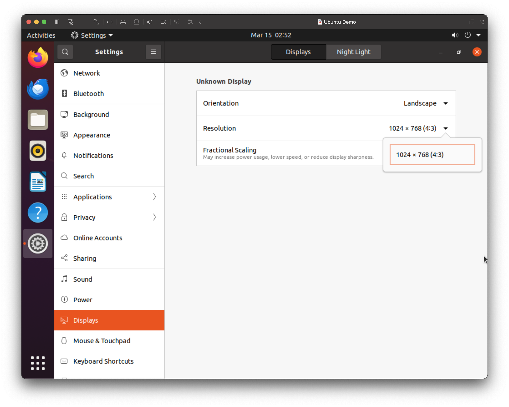

# Ubuntu-VM-On-Mac

## Summary

Set-up Guide Tips and Tricks for getting Ubuntu running on Macbook with Apple Silicon

For thoses interested in wanting to use Ubuntu on their Macbook, this is the repository for you.

The majority of the steps necessary for basic setup of Ubuntu LTS on WMware Fusion come from the article, [Installing Ubuntu using VMWare fusion tech Preview on MAC M1 silicon](https://dev.to/daud99/installing-ubuntu-using-vmware-fusion-tech-preview-on-mac-m1-silicon-4b0e). If this link is no longer working, you can find a pdf of the article [here](https://github.com/BillyMazotti/Ubuntu-With-VMware-Fusion-On-Mac/blob/main/Installing%20Ubuntu%20using%20VMWare%20fusion%20tech%20Preview%20on%20MAC%20M1%20silicon%20-%20DEV%20Community.pdf). HOWEVER, several of the instructions are a bit dated, therefore I recommend you follow the "Ubuntu 20 on Apple Silicon Recommended Steps" below.


## Background Info: Desktop vs Server Image files for ARM64
Apple Silicon processors have a arm64 architecture, therefore in order to install an Ubuntu VM, you'll need an image file (.iso file) that is compatible for arm64. 

If you want a typical desktop graphical user interface, you'll want an image file that typically has the word "desktop" in it (e.g. jammy-desktop-arm64.iso). Otherwise, if you just need the ubuntu terminal or if you can't find a desktop image file, look for an Ubuntu image file that typically has the word "server" in it (e.g. ). You can find arm64 server image files for Ubuntu 16+ at [old-releases.ubuntu.com/releases/](https://old-releases.ubuntu.com/releases/). As far as I ([and these people](https://www.reddit.com/r/Ubuntu/comments/13jmdn2/ubuntu_2004_desktop_arm64/)) are aware, Ubuntu's offical website only offers a Desktop arm64 iamge file for Ubuntu 22 on their [Daily Build](https://cdimage.ubuntu.com/jammy/daily-live/current/). 

For an Ubuntu VM experience that doesn't feel like you're using an old comptuer, I recommend Ubuntu 20+ for their support of newer Linux kernel's which allow for sharper images, adaptable resolution, and much more niceties to have. To see how to upgrade your vm's linux kernel, check out the last section, "Update Linux Kernel for a Better VM Experience"

# Ubuntu 20 on Apple Silicon Recommended Steps
Overview of Steps:

1. Install VMWare Fusion
2. Download the Ubuntu Image File
3. Create Ubuntu VM on VMWare Fusion
4. Update Linux Kernel for a Better VM Experience

## 1. Install VMware Fusion
This tutorial was made using VMware Fusion Player 13.5.1. That said the majority of these steps should in theory be repeatable using the most recent Player or Pro versions of Fusion or Workstation. After Broadcom aquired VMware, the pro versions of VMware were made avaialble as discussed in [this article](https://blogs.vmware.com/teamfusion/2024/05/fusion-pro-now-available-free-for-personal-use.html).
* Download WMware Fusion from Broadcom [here](https://support.broadcom.com/group/ecx/productdownloads?subfamily=VMware+Fusion)
* Download VMware Workstation from Broadcom [here](https://support.broadcom.com/group/ecx/productdownloads?subfamily=VMware+Workstation+Pro) 

## 2. Download the Ubuntu image file
Dowload an arm64.iso file from Ubuntu's [Old Releases](https://old-releases.ubuntu.com/releases/), [Releases](https://cdimage.ubuntu.com/releases/), or [Daily Build](https://cdimage.ubuntu.com/daily-live/current/). For this tutorial, we'll be downloading the file **ubuntu-20.04.5-live-server-arm64.iso** from [here](https://cdimage.ubuntu.com/releases/20.04/release/).

## 3. Create Ubuntu VM on VMWare Fusion
1. With VMWare Fusion open, click on the plus then clock on "New" (photo credits to [daud99](https://dev.to/daud99/installing-ubuntu-using-vmware-fusion-tech-preview-on-mac-m1-silicon-4b0e))


2. On the following window, double click on "Install from disk or image"


3. Drag and drop your downloaded .iso file into the "Drag a disk image here" box


4. Click continue and you'll be taken to the following screen


5. Currently we are only allocating 20GB of hard disk drive memory, 4GB of Unified Memory (RAM), and 2 CPU cores which may not be enough for most applications. To give our VM more power, click on Customize Settings and give your VM a name.


6. Click save and your VM's settings home screen should pop up. If it doesn't, click on the wrench icon as seen in the top left of the following image.

below is the Settings disply


7. Click on Processors & Memory and allocate as much CPU processors and RAM as you think you need. You can alter these values later (by powering off your VM) to optimize your VM's performance. I recommend allocating around half of your processors and half of your memory if you're not doing anything too computationally expensive on your host computer.


8. Click on Show ALl to return to the settings home screen and click on Hard Disck drive. Allocate as much memory storage as you think you'll need. Expanding emory storage is non-trivial therefore I recommend allocating more memory than your think you'll need. For this demo I'll be allocating 75 GB.Click apply.


9. Click on Show All to return to the settings home screen and click on Network Adapter. Ensure that Connect Network Adapter is unchecked as permitting internt connection during the beginning of the installation process may cause issues.


10. Close the settings screen and hit the giant play button. Select all the defaults and keep on going until your reach the following screen.

When prompted, click reboot now.


11. If the VM gets to the following screen, click "Enter"


12. After getting to the following screen, 

open the settings home screen by clicking on the wrench in the top left, go to Network Adapter, and check the box for Connect Network Adapter.


13. You should now be prompted to enter your login name and password that you entered during the "Select all the defaults" portion in step 10. After loggin in, you should seen the following screen.


14. Confirm that the .iso file is not selected by going to settings --> CD/DVD (SATA) and confirming the box to the left of Connect CD/DVD Drive is unselected
 
close the settings window.

15. Time to terminal
Update the existing repositories and reboot
```
sudo apt update
sudo reboot
```
If you get stuck on the following screen, just hit enter and log in again.


16. Install Ubuntu Desktop for your OS GUI
```
sudo apt install ubuntu-desktop
sudo reboot
```

17. Open up terminal and install VMWare tools to allow for copying and pasting between your host and virtual machines
```
sudo apt install -y open-vm-tools-desktop
sudo reboot
```

18. Click on the save icon in the top left corner of the windoq to create a checkpoint of your Virtual Machine so that you don't have to repeat all the previous steps in case your VM breaks.

Double click on Current State

Name your checkpoint

And you are done!


## 4. Update Linux Kernel for a Better VM Experience
If you just installed the Ubuntu 20 VM, you may notice the resolution is not the best. Going to Settings --> Displays, we see that we only have access to one display resolution irregardless of our monitor's resolution.



To fix this we need to update our VM's Linux Kernel. Open up terminal.

To see the version of our current Linux Kerenel, enter 
```
uname -r
```

To upgrade this version, enter
```
sudo apt dist-upgrade
sudo apt install linux-generic-hwe-20.04
sudo reboot
```
For Wbuntu 22.04 use `sudo apt install linux-generic-hwe-22.04` according to [here](https://www.omgubuntu.co.uk/2024/01/ubuntu-2204-linux-6-5-kernel-update#:~:text=To%20install%20the%20Linux%206.5,upgrade%20will%20do%20the%20trick.).

Going back to settings, you will now see more resolution options available.

Optional Recommendation: go to your VM's settings home screen, click on display and check the "Use full resolution for Retina display" box.

